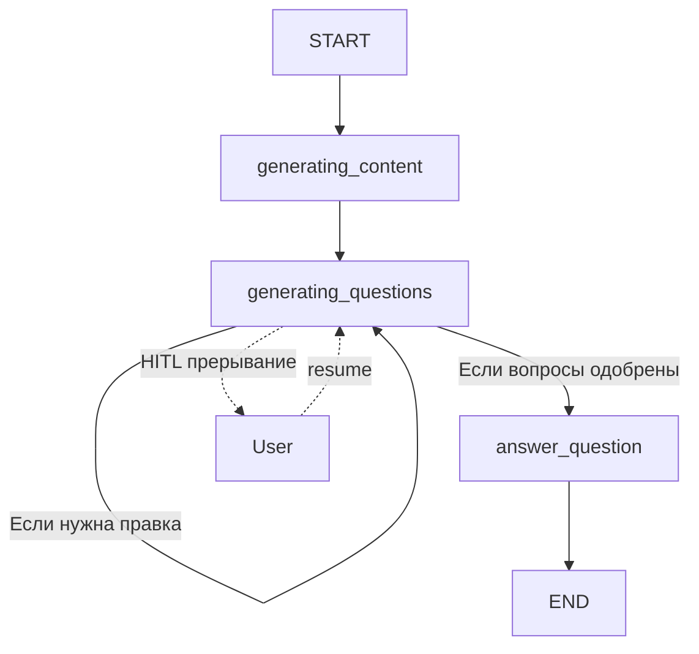

# AI_Statistics-Teacher

Это мой учебный проект по NLP, реализующий мультиагентную систему для автоматической генерации учебных материалов, дополнительных вопросов и ответов по математической статистике с использованием локальной модели **Qwen2.5-1.5B-Instruct** и **Human-in-the-Loop (HITL)** для уточнения вопросов.

---

## 1. Назначение мультиагентной системы

Проект демонстрирует применение современных NLP-техник для создания интерактивного помощника преподавателя. Система:

- Принимает экзаменационный вопрос по математической статистике.
- Генерирует подробный учебный материал с формулами и пояснениями.
- На основе материала предлагает 5 дополнительных вопросов для углубления темы.
- Позволяет пользователю (преподавателю) одобрить или скорректировать вопросы (HITL).
- Параллельно генерирует развёрнутые ответы на утверждённые вопросы.
- Сохраняет итоговый результат в Markdown-файл.

Цель — изучить возможности **LangGraph** для построения графовых LLM-приложений, **промпт-инжиниринг**, **HITL** и **параллельную генерацию**.

---

## 2. Архитектура

Система построена в виде направленного графа состояний (StateGraph) с тремя основными узлами:

**Узлы:**

- `generating_content` – генерирует основной учебный материал.
    
- `generating_questions` – генерирует или уточняет дополнительные вопросы; содержит точку HITL.
    
- `answer_question` – параллельно (через `Send`) генерирует ответы на каждый вопрос.
    

**Состояние (ExamState):**  
хранит вопрос, сгенерированный материал, список текущих вопросов, пары «вопрос-ответ» и историю обратной связи.

**Ключевая особенность:**  
узел `generating_questions` может вызывать сам себя (рекурсивно) для уточнения вопросов на основе обратной связи пользователя. После одобрения все вопросы отправляются на параллельную генерацию ответов.

## 3. Стек технологий

|Компонент|Технологии|
|---|---|
|**LLM**|Qwen2.5-1.5B-Instruct (float16, локально через HuggingFace)|
|**Фреймворк агентов**|LangGraph + LangChain|
|**Управление памятью**|MemorySaver (чекпоинтинг для HITL)|
|**Промпты**|Jinja2-шаблоны, кастомные инструкции для извлечения и уточнения вопросов|
|**Извлечение**|Регулярные выражения (RE) для парсинга нумерованных вопросов|
|**Параллелизм**|`Send` API из LangGraph|
|**Среда**|Python 3.10, Jupyter Notebook, PyTorch, transformers|

---

## 4. Пример потока выполнения (с HITL)

1. **Входной вопрос:**  
    `"Раскройте тему: 'Параметрический критерий различий и сдвигов: t-Критерий Стьюдента.'"`
    
2. **Генерация материала:**  
    Система выводит подробную лекцию с формулами, определениями и примерами.
    
3. **Генерация начальных вопросов:**  
    Модель предлагает 5 дополнительных вопросов (например, «Как выводится формула стандартной ошибки разности средних?», «Почему для критерия Стьюдента важно нормальное распределение?» и т.д.).
    
4. **HITL-прерывание:**  
    Пользователю показываются вопросы и предлагается ввести обратную связь:
    
    - Если ввести `"дальше"`, `"хорошо"`, `"подходит"` → вопросы одобряются, система переходит к ответам.
        
    - Если дать правки (например, `"вопрос 3 слишком простой, замени на ..."`) → система генерирует уточнённые вопросы и снова запрашивает одобрение.
        
5. **Параллельная генерация ответов:**  
    На каждый одобренный вопрос запускается отдельная задача (`answer_question_node`), они выполняются параллельно с помощью `Send`.
    
6. **Сохранение результата:**  
    Финальный файл `statistics_lecture.md` содержит основной материал и все дополнительные ответы.
    

---

## 5. Особенности NLP-решений

### 5.1 Промпт-инжиниринг

- **Генерация материала:**  
    Промпт требует полноты, пошаговых выводов, использования LaTeX-формул (`$...$` для inline, `$$...$$` для блоков) и примеров из реальной статистики.
    
- **Генерация вопросов:**  
    Жёсткий формат – 5 пронумерованных вопросов, каждый с вопросительным знаком. Добавлен пример правильного ответа, чтобы модель не отклонялась от структуры.
    
- **Уточнение вопросов:**  
    Промпт анализирует обратную связь пользователя и либо выводит `"FINALIZE"`, либо возвращает исправленный список.
    

### 5.2 Извлечение вопросов без JSON

Функция `extract_questions_from_text` использует:

- Регулярное выражение для поиска строк вида `"1. Текст вопроса?"` или `"1) Текст вопроса?"`.
    
- Фильтр по вопросительным словам (`как`, `что`, `почему`, `объясните` и т.д.).
    
- Отбрасывание шумовых слов (например, `"полнота"`, `"ясность"`, которые могут попасть из промпта).
    
- Падение на fallback-вопрос, если ничего не найдено.
    

Это сделано для устойчивости к нестабильному JSON-выводу маленькой модели.

### 5.3 Human-in-the-Loop (HITL)

Реализован через `interrupt()` из `langgraph.types`.  
При первом входе в узел `generating_questions` генерируются вопросы, затем вызывается `interrupt`, который останавливает граф и запрашивает ввод пользователя.  
Пользовательский ввод передаётся через `Command(resume=...)`, после чего выполнение продолжается.  
Состояние сохраняется через `MemorySaver`, поэтому можно остановить и возобновить выполнение в любой момент.

### 5.4 Параллельная генерация

Вместо последовательного вызова LLM для каждого вопроса, узел `generating_questions` возвращает список `Send("answer_question", {"question": q})`.  
LangGraph запускает все `answer_question` узлы параллельно, что экономит время при большом количестве вопросов.

## 6. Результаты работы

Пример сгенерированного материала (gif):

* Демонстрация из программы Obsidian
Полный сгенерированный файл на вопрос "Параметрический критерий различий и сдвигов: т-критерий Стьюдента" прилагаю (statistics_lecture.md)

## 7. Возможные улучшения

- **Замена модели** на более мощную (например, Qwen7B или Mistral. В идеале подключить мощьную модель через API_KEY) для улучшения качества формул.
    
- **Добавление RAG** – поиска по учебникам математической статистики для фактической проверки.
    
- **Валидация формул** – автоматическая проверка синтаксиса LaTeX.
    
- **Интерактивный режим** – веб-интерфейс (Streamlit/Gradio) вместо консольного ввода.
    
- **Кэширование** – сохранение сгенерированных материалов для повторного использования.
    
- **Логирование** – отслеживание всех вызовов LLM для анализа токенов и задержек.
